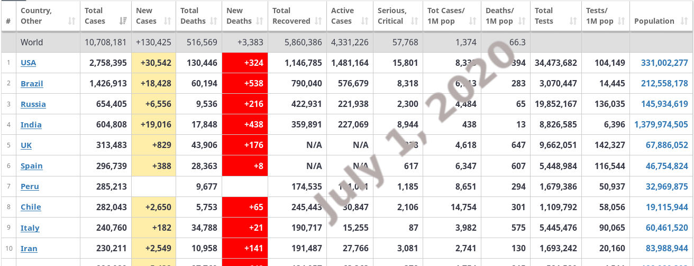

# [Covid-19 data scraper](https://github.com/kipronokoech/Web-Scraper/tree/master/covid-19-data)
In this project we will scrape covid data from [Worldometer](https://www.worldometers.info/coronavirus/) website and deploy the same data into Google sheet.

Everytime you run the code you will get the lastest
COVID-19 data from [Worldometer](https://www.worldometers.info/coronavirus/).
If you want to save yourself the hustle having
to manually execute the scripts everytime
you can automate it as using crontab task scheduler in Linux (Debian) -what I use-
or Schedule tasks in Windows.

## Root Dir - Files and Folders:
1. `assets` - Folder. Holds the images folders which should guide
on how to get site elements and also display output.
2. `scraper.ipynb` and `scraper.py` - Codes for web
scrapping These two files are ideally the same. The former is notebook and 
the latter is a Python file. I wrote the `py`
file so that I can call it as a module in
`deploy.py` making the code to be clean.
3. `deploy.py` - In this file we will deploy
the data we scrapped in (2) into Google Sheet.
[GSpread documentation](https://gspread.readthedocs.io/en/latest/)
should be a useful guide to go through this notebook.

## Website vs Scraped Data as a DataFrame

<table style="width:100%">
  <tr>
    <th></th>
  </tr>
</table>
<table style="width:100%">
  <tr>
    <th>
  </tr>
</table>

## Conclusion

Personally, I am using this idea of scrapping
this particular site to maintain a dashboard in
Google Studio. This is made possible by periodic
 scrapping and deployment (every 15 minutes) using crontab scheduler.
 
[Here](https://datastudio.google.com/open/1wZ1ismEZwcQCrUJq2NsPsqHrdx1EM0ak?usp=sharing) is the dashboard.

Useful link about crontab in Linux: [link](https://opensource.com/article/17/11/how-use-cron-linux)

Stay Safe!

# [Video Site Data Scraper](https://github.com/kipronokoech/Web-Scraper/tree/master/Internet-Archive)

# [GDP Data Scraper](https://github.com/kipronokoech/Web-Scraper/tree/master/gdp-data) 
# [Reviews Scraper](https://github.com/kipronokoech/Web-Scraper/tree/master/reviews-collection)

